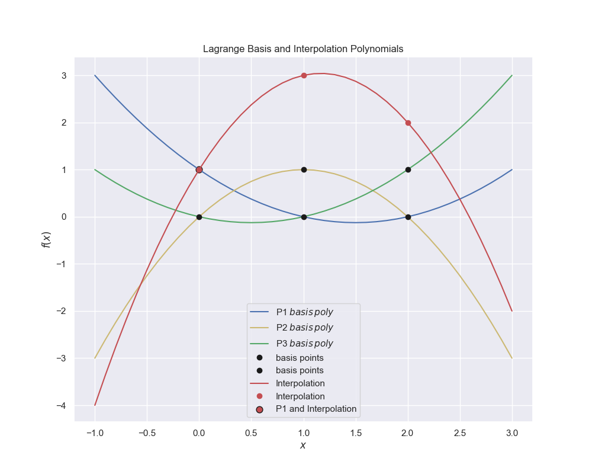

### Pesky-Imps!

# Mostly Iterative Methods

Iterative methods used for interpolation, extrapolation, root finding and equation optimisation, many of the methods are similar.

## See the working copy

[Read the Docs](https://pesky-imps.readthedocs.io/en/latest/)

1. Interpolating
   * Introduction Interpolation
   * Linear Interpolation
   * Quadratic Interpolation
   * Lagrange Polynomial Interpolation
     
   * Newton Polynomial Interpolation
   * Cubic Spline Interpolation
2. Extrapolation
   * Extrapolation Introduction
   * Linear Extrapolation
   * Linear Regression
3. Roots of an Equation
   * Introduction Iterations
   * Interval-Halving
   * Linear Interpolation
   * Secant Method
   * Newton Raphson Method
   * Inverse Quadratic Interpolation
   * Brent’s Method
   * Summary Root Finding
4. Optimisation
   * Extrema Introduction
   * Halving the Interval
   * Golden Rule
   * Optimise with Quadratic Polynomial
   * Optimisation with Newton Raphson
   * Minimum with Brent
   * More Complex Functions
5. Authors
   * Contributors
   * Contact
6. General
   * The While Loop
   * PrettyTable
   * Those Pesky Imps
