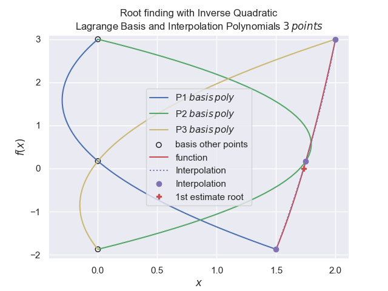

===============================
Inverse Quadratic Interpolation
===============================

In quadratic interpolation we obtained the new y-value by combining
three Lagrange curves, here we need the x value.
Inverse quadratic interpolation (IQI) is just quadratic interpolation using 
the y-values as inputs and the x-value as output. Therefore when trying to
find a root (when y is 0) the answer is given directly.

.. math::

    x = x_1 \left(\frac {y - y_2}{y_1 - y_2} \cdot \frac {y - y_3}{y_1 - y_3}\right) +
    x_2 \left(\frac {y - y_1}{y_2 -y_1} \cdot \frac {y - y_3}{y_2 - y_3}\right) +
    x_3 \left(\frac {y - y_1}{y_3 - y_1} \cdot \frac {y - y_2}{y_3 - y_2}\right)

Draw 3 Lagrange polynomials each passing through a different
point of the 3 input values, the x-value is zero at the other input values. 
Combine these 3 curves to create a fourth curve that 
passes through every input point. The root is present when the function y
is zero.

    
    Plot of input to first interpolation, the root is shown as the red
    cross when y=0

Compare these curves to those for :ref:`lagrange<lag-interp>` interpolation,
inverse quadratic interpolation turns the Lagrange ploynomials sideways.

When applying this method, usually the points are selected by using the 
central point as the best zero so far (f(x0) > f(x1) and f(x2) > f(x1)),
the new f(x0) is the old best point which was f(x1), and the new f(x1) and
f(x2) bracket the sign change.

.. container:: toggle

    .. container:: header

        *Show/Hide Code* IQI_rev.py

    .. literalinclude:: ../examples/eq/IQI_rev.py

This resulted in the following output for our test curve::

    +------+-----------+-----------+----------+------------+------------+------------+-----------+
    | step |     x0    |     x1    |    x2    |   f(x0)    |   f(x1)    |   f(x2)    |    tol    |
    +------+-----------+-----------+----------+------------+------------+------------+-----------+
    |  0   |    1.5    |    1.75   |    2     |   -1.875   |  0.171875  |     3      |    0.25   |
    |  1   |    1.75   |  1.731238 |   1.5    |  0.171875  | -0.0076882 |   -1.875   |  0.018762 |
    |  2   |  1.731238 | 1.7320538 |   1.75   | -0.0076882 |  2.86e-05  |  0.171875  | 0.0008158 |
    |  3   | 1.7320538 | 1.7320508 | 1.731238 |  2.86e-05  |    -0.0    | -0.0076882 |   3e-06   |
    +------+-----------+-----------+----------+------------+------------+------------+-----------+
    root is: 1.732051
    steps taken: 3

Reverse the x_values, the results are comparable::

    +------+-----------+-----------+----------+------------+------------+------------+-----------+
    | step |     x0    |     x1    |    x2    |   f(x0)    |   f(x1)    |   f(x2)    |    tol    |
    +------+-----------+-----------+----------+------------+------------+------------+-----------+
    |  0   |     2     |    1.75   |   1.5    |     3      |  0.171875  |   -1.875   |    0.25   |
    |  1   |    1.75   |  1.731238 |    2     |  0.171875  | -0.0076882 |     3      |  0.018762 |
    |  2   |  1.731238 | 1.7320484 |   1.75   | -0.0076882 | -2.27e-05  |  0.171875  | 0.0008104 |
    |  3   | 1.7320484 | 1.7320508 | 1.731238 | -2.27e-05  |    0.0     | -0.0076882 |  2.4e-06  |
    +------+-----------+-----------+----------+------------+------------+------------+-----------+
    root is: 1.732051
    steps taken: 3

Select starting points further away from the root::

    +------+-----------+-----------+-----------+-----------+-----------+-----------+-----------+
    | step |     x0    |     x1    |     x2    |   f(x0)   |   f(x1)   |   f(x2)   |    tol    |
    +------+-----------+-----------+-----------+-----------+-----------+-----------+-----------+
    |  0   |     2     |    2.5    |     3     |     3     |   11.375  |     24    |    0.5    |
    |  1   |    2.5    |  1.788237 |     2     |   11.375  | 0.5514901 |     3     |  0.711763 |
    |  2   |  1.788237 | 1.7364463 |    2.5    | 0.5514901 |  0.041719 |   11.375  | 0.0517908 |
    |  3   | 1.7364463 |  1.732135 |  1.788237 |  0.041719 | 0.0007973 | 0.5514901 | 0.0043112 |
    |  4   |  1.732135 | 1.7320508 | 1.7364463 | 0.0007973 |   1e-07   |  0.041719 |  8.42e-05 |
    |  5   | 1.7320508 | 1.7320508 |  1.732135 |   1e-07   |    0.0    | 0.0007973 |    0.0    |
    +------+-----------+-----------+-----------+-----------+-----------+-----------+-----------+
    root is: 1.732051
    steps taken: 5

Now some way away, still works::

    +------+-----------+-----------+-----------+-------------+-------------+-------------+-----------+
    | step |     x0    |     x1    |     x2    |    f(x0)    |    f(x1)    |    f(x2)    |    tol    |
    +------+-----------+-----------+-----------+-------------+-------------+-------------+-----------+
    |  0   |     10    |     12    |     14    |     1067    |     1833    |     2895    |     2     |
    |  1   |     12    | 6.4354908 |     10    |     1833    | 285.6384033 |     1067    | 5.5645092 |
    |  2   | 6.4354908 | 4.7481614 |     12    | 285.6384033 | 112.3480229 |     1833    | 1.6873294 |
    |  3   | 4.7481614 |  3.539698 | 6.4354908 | 112.3480229 |  43.2608785 | 285.6384033 | 1.2084634 |
    |  4   |  3.539698 | 2.6274799 | 4.7481614 |  43.2608785 |  14.1604143 | 112.3480229 | 0.9122181 |
    |  5   | 2.6274799 | 2.0971472 |  3.539698 |  14.1604143 |   4.329894  |  43.2608785 | 0.5303327 |
    |  6   | 2.0971472 | 1.8279663 | 2.6274799 |   4.329894  |  0.9656392  |  14.1604143 |  0.269181 |
    |  7   | 1.8279663 | 1.7424442 | 2.0971472 |  0.9656392  |   0.099035  |   4.329894  |  0.085522 |
    |  8   | 1.7424442 | 1.7322487 | 1.8279663 |   0.099035  |  0.0018735  |  0.9656392  | 0.0101955 |
    |  9   | 1.7322487 | 1.7320509 | 1.7424442 |  0.0018735  |   1.3e-06   |   0.099035  | 0.0001978 |
    |  10  | 1.7320509 | 1.7320508 | 1.7322487 |   1.3e-06   |     0.0     |  0.0018735  |   1e-07   |
    +------+-----------+-----------+-----------+-------------+-------------+-------------+-----------+
    root is: 1.732051
    steps taken: 10

But negative x-values shows a different root, which was :ref:`correct<root>` ::

    +------+------------+------------+------------+------------+------------+------------+-----------+
    | step |     x0     |     x1     |     x2     |   f(x0)    |   f(x1)    |   f(x2)    |    tol    |
    +------+------------+------------+------------+------------+------------+------------+-----------+
    |  0   |     -2     |     -4     |     -6     |     -1     |    -39     |    -165    |     2     |
    |  1   |     -4     | -1.9386271 |     -2     |    -39     | -0.7117373 |     -1     | 2.0613729 |
    |  2   | -1.9386271 | -1.7841144 |     -4     | -0.7117373 | -0.1435432 |    -39     | 0.1545127 |
    |  3   | -1.7841144 | -1.7445063 | -1.9386271 | -0.1435432 | -0.0322388 | -0.7117373 | 0.0396081 |
    |  4   | -1.7445063 | -1.7324625 | -1.7841144 | -0.0322388 | -0.0010447 | -0.1435432 | 0.0120438 |
    |  5   | -1.7324625 | -1.732052  | -1.7445063 | -0.0010447 |   -3e-06   | -0.0322388 | 0.0004105 |
    |  6   | -1.732052  | -1.7320508 | -1.7324625 |   -3e-06   |    -0.0    | -0.0010447 |  1.2e-06  |
    +------+------------+------------+------------+------------+------------+------------+-----------+
    root is: -1.732051
    steps taken: 6

The IQI method is rarely used by itself as it frequently does not converge,
usually because 2 of the Lagrange curves coincide. However it is used as
part of Brent's method shown next.