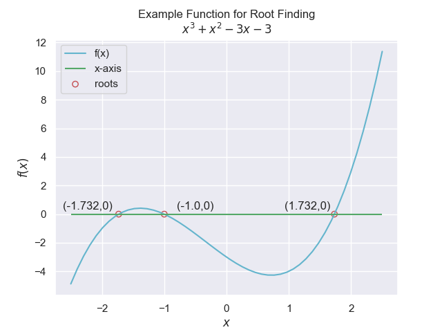
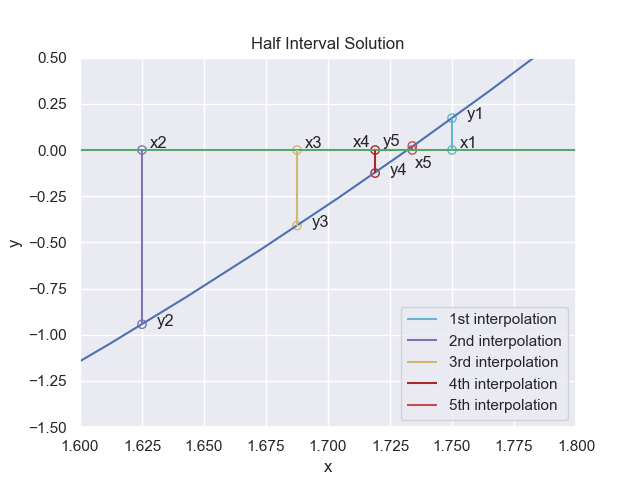

================
Interval-Halving
================

Starting from a polynomial equation, determine the roots of the 
equation.

.. math::

    y = f(x)

The roots correspond to those x-values where the y-value is 0. Generally 
there is no simple algebraic
solution, so an iterative method is required. The function must be continuous
so that each approximation becomes better than the preceeding ones. This 
also requires that the first approximation should be close enough to the
final solution that no other solutions are nearer.

Interval-halving follows the following method.

1. Find the values of y over a set of x values.
2. Choose the two adjacent values of x where the y values change sign.
3. While the half the modulus of the difference between the adjacent x values (a and b) is greater than a required tolerance
    
    4. Set a new x value(x1) to the mean of a and b
    5. If f(x1) is the opposite sign to f(a)
    
        5.1. Set b to x1
        
    6. Else
    
        6.1. Set a to x1

This method is the simplest to program but usually takes the most number of 
iterative steps.

Using the following example polynomial.

.. math::

    f(x) = x^3 + x^2 - 3\cdot x - 3 = 0

Plot this::

    import matplotlib.pyplot as plt
    import numpy as np
    
    x = np.linspace(0, 3)
    plt.figure(figsize=(12,6))
    plt.plot(x, x**3 + x**2 -3*x -3)
    plt.plot([0,3], [0,0], 'g')
    plt.grid(True)
    plt.show()

To obtain a smooth plot the function was evaluated 50 times, the default used
in **linspace**.

    
    The equation is plotted in blue and the x-axis is in green, our root
    lies on the intersection of these two lines, between 1.5 and 2.0.

Applying the algorithm::

    # halving intervals
    from prettytable import PrettyTable

    x = PrettyTable(['step', 'a', 'b', 'x1', 'f(a)', 'f(b)', 'f(x1)', 'emax'])

    a = 1.5
    b = 2.0

    f lambda x: x**3 + x**2 - 3*x - 3

    Fa = f(a)
    Fb = f(b)
    step = 0

    x.add_row([step, a, b, None, Fa, Fb, None, abs(b - a)/2])
    
    while abs(b - a)/2 >= 5e-5 and step < 19:
        step += 1
        x1 = (a+b)/2
        F1 = f(x1)

        if Fa*F1 < 0:
            b = x1
            Fb = F1
        else:
            a = x1
            Fa = F1

        x.add_row([step, round(a,7), round(b,7), round(x1,7), round(Fa,7), \
                    round(Fb,7), round(F1,7), round(abs(b - a)/2,7)])

    print(x)
    print()
    print (f"Root is: {(a+b)/2:.7} found in {step} iterations")

A plot of the resulting steps is shown next.

    
    The starting positions are shown at points 1.5 and 2.0, the 1st interpolation
    x1 at 1.75, the 2nd x2 at 1.625 and so on.
    
    At this enlargement the function is almost a straight line, also note
    how the steps were not always the best estimate, x1 being better than
    x2 and x3 even though the outer limits were coming closer. 

In order to achieve an error with an accuracy of 4 decimal places this method
required 13 steps::

    +------+-----------+-----------+-----------+------------+-----------+------------+-----------+
    | step |     a     |     b     |     x1    |    f(a)    |    f(b)   |   f(x1)    |    emax   |
    +------+-----------+-----------+-----------+------------+-----------+------------+-----------+
    |  0   |    1.5    |    2.0    |    None   |   -1.875   |    3.0    |    None    |    0.25   |
    |  1   |    1.5    |    1.75   |    1.75   |   -1.875   |  0.171875 |  0.171875  |   0.125   |
    |  2   |   1.625   |    1.75   |   1.625   | -0.9433594 |  0.171875 | -0.9433594 |   0.0625  |
    |  3   |   1.6875  |    1.75   |   1.6875  | -0.4094238 |  0.171875 | -0.4094238 |  0.03125  |
    |  4   |  1.71875  |    1.75   |  1.71875  | -0.1247864 |  0.171875 | -0.1247864 |  0.015625 |
    |  5   |  1.71875  |  1.734375 |  1.734375 | -0.1247864 | 0.0220299 | 0.0220299  | 0.0078125 |
    |  6   | 1.7265625 |  1.734375 | 1.7265625 | -0.0517554 | 0.0220299 | -0.0517554 | 0.0039062 |
    |  7   | 1.7304688 |  1.734375 | 1.7304688 | -0.0149572 | 0.0220299 | -0.0149572 | 0.0019531 |
    |  8   | 1.7304688 | 1.7324219 | 1.7324219 | -0.0149572 | 0.0035127 | 0.0035127  | 0.0009766 |
    |  9   | 1.7314453 | 1.7324219 | 1.7314453 | -0.0057282 | 0.0035127 | -0.0057282 | 0.0004883 |
    |  10  | 1.7319336 | 1.7324219 | 1.7319336 | -0.0011092 | 0.0035127 | -0.0011092 | 0.0002441 |
    |  11  | 1.7319336 | 1.7321777 | 1.7321777 | -0.0011092 | 0.0012013 | 0.0012013  | 0.0001221 |
    |  12  | 1.7319336 | 1.7320557 | 1.7320557 | -0.0011092 |  4.6e-05  |  4.6e-05   |  6.1e-05  |
    |  13  | 1.7319946 | 1.7320557 | 1.7319946 | -0.0005317 |  4.6e-05  | -0.0005317 |  3.05e-05 |
    +------+-----------+-----------+-----------+------------+-----------+------------+-----------+

    root is: 1.732025 found in 13 iterations

Apart from initialisation, at every iteration only the newly evaluated point
is calculated position and its function value, the other points recycle the 
previous values. To give a
tabular overview at every step the PrettyTable module was used.