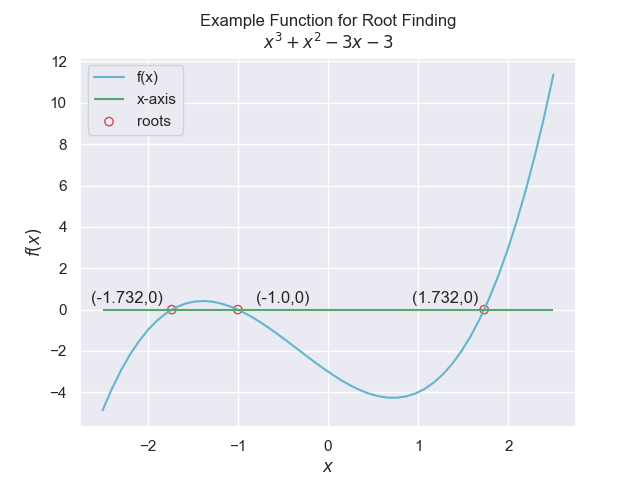

=======================
Introduction Iterations
=======================

Apart from the solution to linear and quadratic equations there are few functions
where the roots can be found directly.

.. math::

    x = \frac {-b \pm \sqrt{b^2 - 4 \cdot a \cdot c}}{2 \cdot a}

Hence the need for the numerical iterative methods. Where possible  
arrange the target equation to be an explicit rather than
implicit type. To find the root of an equation we are simply stating
that our function :math:`y = f(x)` is zero, therefore use the same methods to
use as an efficient search algorithm by changing the function to 
:math:`g(x) = f(x) - t` (**t** search target) is zero.

Iterative processes require a loop of some sort, as the number of steps
is unknown the **while** loop is used. Set up the while condition with the
target condition and add a
limit to the number of iterations (especially important when first
setting up the script). When first dealing with a problem first plot the function
to check whether the function is continuous and the rough positions of the 
roots.

One could determine the root from the plot and zoom in to get a more accurate
root position, but this is inefficient as the equation needs to be used many 
times to obtain accurate information, and it requires user intervention. That
is why iterative processes are required. The iterative processes can
be applied to transcendental equations(equations that contain functions that 
are an infinite series such as trignometric, exponential and logarithmic),
but can run into difficulties with discontinuous equations.

The iterative methods shown in this web site are the better known ones. Some 
methods can hybridise two types (Brent). When the function is straightforward the
faster methods usually work best, but if the function becomes more complex
then the slower methods may be the only ones that can find the root. Methods
such as interval halving and linear interpolation only work if the root is
bracketed by the input guesses, other methods (secant and Newton) are open, 
but the rate of convergence is slowed down by poor input guesses and can 
become divergent. The Newton method requires a first derivative (not always
easy). The Brent method is a good compromise, being reasonably fast and 
robust.

Usually convergence depends upon how good the initial guess is. Where 
possible linearise the expression so that it is reduced to a simple line 
(all powers of x are ignored), then where this computed line intercepts the 
x-axis (y=0) there lies a reasonable estimate of our root. In any event, 
the evaluation of the upper and lower limits should produce
a positive and a negative value.

The same function 

.. math::

    f(x) = x^3 + x^2 - 3\cdot x - 3

is used for the root finding methods, so that the performance of the various
methods can be compared.

.. _root:

    
    The function has a maximum and a minimum with three roots

