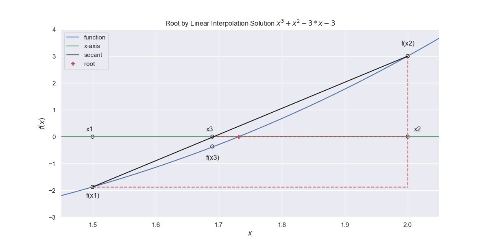

====================
Linear Interpolation
====================

The method of interval halving can be improved upon by linear interpolation,
also known as the false position or secant method. This improves the rate
of finding the solution. When the starting points are selected a line joining
the two points on the curve is drawn and where this intersects the x-axis a
new point is created. This line approximates the tangent at the root, used 
later in Newton's method.

    
    The position of the calculated point (x3) is shown for the first
    interpolation

.. math::

    \frac{x2 - x3}{x2 - x1} & = \frac{f(x2)}{f(x2) - f(x1)} \\
    x3 & = x2 - \frac{f(x2)}{f(x2) - f(x1)} \cdot (x2 - x1)

The algorithm for this method is

1. while \|x2 - x1\| is greater than a required tolerance

    2. set x3 = x2 - f(x2) (x2 - x1) / (f(x2) - f(x1))
    3. if f(x3) is the opposite sign to f(x1)
    
        3.1. set x2 = x3
        
    4. else
    
        4.1. set x1 = x3

For comparison use the same polynomial as used in the interval halving.

.. container:: toggle

    .. container:: header

        *Show/Hide Code* lin_curtis.py

    .. literalinclude:: ../examples/eq/lin_curtis.py

which originally resulted in::

    +------+-----------+-----------+-----------+------------+-------+------------+-----------+
    | step |     a     |     b     |     x1    |      fa    |  fb   |   f(x1)    |   |b-a|   |
    +------+-----------+-----------+-----------+------------+-------+------------+-----------+
    |  0   |    1.5    |    2.0    |    None   |   -1.875   |  3.0  |    None    |    0.5    |
    |  1   | 1.6923077 |    2.0    | 1.6923077 | -0.3664087 |  3.0  | -0.3664087 | 0.3076923 |
    |  2   | 1.7257977 |    2.0    | 1.7257977 | -0.0589377 |  3.0  | -0.0589377 | 0.2742023 |
    |  3   | 1.7310809 |    2.0    | 1.7310809 | -0.0091736 |  3.0  | -0.0091736 | 0.2689191 |
    |  4   | 1.7319007 |    2.0    | 1.7319007 | -0.0014205 |  3.0  | -0.0014205 | 0.2680993 |
    |  5   | 1.7320276 |    2.0    | 1.7320276 | -0.0002198 |  3.0  | -0.0002198 | 0.2679724 |
    |  6   | 1.7320472 |    2.0    | 1.7320472 |  -3.4e-05  |  3.0  |  -3.4e-05  | 0.2679528 |
    |  7   | 1.7320503 |    2.0    | 1.7320503 |  -5.3e-06  |  3.0  |  -5.3e-06  | 0.2679497 |
    |  8   | 1.7320507 |    2.0    | 1.7320507 |   -8e-07   |  3.0  |   -8e-07   | 0.2679493 |
    |  9   | 1.7320508 |    2.0    | 1.7320508 |   -1e-07   |  3.0  |   -1e-07   | 0.2679492 |
    |  10  | 1.7320508 |    2.0    | 1.7320508 |    -0.0    |  3.0  |    -0.0    | 0.2679492 |
    ....
    |  19  | 1.7320508 |    2.0    | 1.7320508 |    -0.0    |  3.0  |    -0.0    | 0.2679492 |
    +------+-----------+-----------+-----------+------------+-------+------------+-----------+

Although usually faster than interval halving, this method often clings to 
one side of the range, so the difference between the upper and lower limits 
hardly changes after a limited number of interpolations, although the resulting
x-value was getting closer to the root. Change the value sought from the
absolute difference between the two outer limits to the absolute function value
of the calculated position. This gave::

    +------+-----------+-----+-----------+------------+------+------------+-----------+
    | step |     a     |  b  |     x1    |    f(a)    | f(b) |   f(x1)    |  |f(x1)|  |
    +------+-----------+-----+-----------+------------+------+------------+-----------+
    |  0   |    1.5    | 2.0 |    None   |   -1.875   | 3.0  |    None    |    0.5    |
    |  1   | 1.6923077 | 2.0 | 1.6923077 | -0.3664087 | 3.0  | -0.3664087 | 0.3076923 |
    |  2   | 1.7257977 | 2.0 | 1.7257977 | -0.0589377 | 3.0  | -0.0589377 | 0.2742023 |
    |  3   | 1.7310809 | 2.0 | 1.7310809 | -0.0091736 | 3.0  | -0.0091736 | 0.2689191 |
    |  4   | 1.7319007 | 2.0 | 1.7319007 | -0.0014205 | 3.0  | -0.0014205 | 0.2680993 |
    |  5   | 1.7320276 | 2.0 | 1.7320276 | -0.0002198 | 3.0  | -0.0002198 | 0.2679724 |
    |  6   | 1.7320472 | 2.0 | 1.7320472 |  -3.4e-05  | 3.0  |  -3.4e-05  | 0.2679528 |
    +------+-----------+-----+-----------+------------+------+------------+-----------+
    Root found : 1.732047 in 6 interpolations

Originally the test was to compare whether fa and f1 were of opposite sign,
this was changed so that fa and fb were compared for sign::

    linear root finding - curtis
    +------+-----------+-----------+-----------+-----------+------------+------------+-----------+
    | step |     a     |     b     |     x1    |    f(a)   |    f(b)    |   f(x1)    |  |f(x1)|  |
    +------+-----------+-----------+-----------+-----------+------------+------------+-----------+
    |  0   |    1.5    |    2.0    |    None   |   -1.875  |    3.0     |    None    |    0.5    |
    |  1   |    1.5    | 1.6923077 | 1.6923077 |   -1.875  | -0.3664087 | -0.3664087 | 0.3664087 |
    |  2   | 1.7390157 | 1.6923077 | 1.7390157 | 0.0662169 | -0.3664087 | 0.0662169  | 0.0662169 |
    |  3   | 1.7390157 | 1.7318666 | 1.7318666 | 0.0662169 | -0.001743  | -0.001743  |  0.001743 |
    |  4   | 1.7390157 |  1.73205  |  1.73205  | 0.0662169 |  -7.9e-06  |  -7.9e-06  |  7.9e-06  |
    +------+-----------+-----------+-----------+-----------+------------+------------+-----------+
    Root found : 1.73205 in 4 interpolations