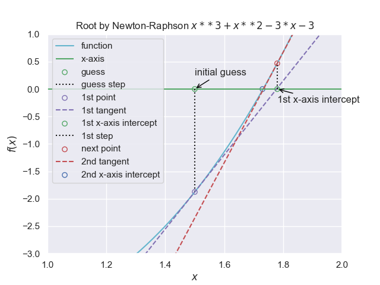

=====================
Newton Raphson Method
=====================

Given that we have a smooth and continuous function where a differential can
be found, this method gives a very fast way to find the root. The derivative 
can help determine the direction and how far away the root lies. This should 
improve on the secant method provided the starting point is chosen close enough
to the correct root and does not coincide with a maximum or minimum.

When using this method the root is not bracketed, only a single starting
value :math:`x_0` is required, a closer value to the root is :math:`x_1`.

.. math::

    0 &= f(x_0) + f´(x_0)(x_1 - x_0) \\
    x_1 &= x_0 - \frac {f(x_0)}{f´(x_0)}

    
    This method quickly finds the root
    
    Draw a tangent to the function at the first guess, where the tangent 
    intercepts the x-axis draw a vertical to intercept the function, then 
    draw a second tangent to the function. Where the tangent intercepts the
    x-axis is very close to the root.

Using the following script if the function's differential is not easily found. 
It uses the definition of a differential:-

.. math::

    \delta y / \delta x_{\delta x \to 0} = dy/dx

where δy is a small change in the function y caused by a small change in x (δx). 
Divide δy by δx and as δx approaches zero we come to the differential dy/dx 
which is the tangent to the function at (x,y). This the function 
discrete_method_approx::

    def discrete_method_approx(f, x, h=.00000001):
        return (f(x+h) - f(x)) / h

where f(x) is the function value at x.

.. container:: toggle

    .. container:: header

        *Show/Hide Code* newton_nick.py

    .. literalinclude:: ../examples/eq/newton_nick.py

we arrive at the following::

    +-------+-----------+------------+------------+-----------+
    | steps |     x     |     df     |    f(x)    | tolerance |
    +-------+-----------+------------+------------+-----------+
    |   0   |     1     |    2.0     |     -4     |   1e-05   |
    |   1   |    3.0    |    30.0    | 24.0000004 |   1e-05   |
    |   2   |    2.2    | 15.9199999 |   5.888    |   1e-05   |
    |   3   | 1.8301508 | 10.7086569 | 0.9890012  |   1e-05   |
    |   4   | 1.7377955 |  9.53539   | 0.0545726  |   1e-05   |
    |   5   | 1.7320723 | 9.4643679  | 0.0002033  |   1e-05   |
    |   6   | 1.7320508 | 9.4641014  |    0.0     |   1e-05   |
    +-------+-----------+------------+------------+-----------+
    root is: 1.732051 in 6 interpolations

Now use a better starting value::

    +-------+-----------+------------+-----------+-----------+
    | steps |     x     |     df     |    f(x)   | tolerance |
    +-------+-----------+------------+-----------+-----------+
    |   0   |     2     | 12.9999999 |     3     |   1e-05   |
    |   1   | 1.7692308 | 9.9289941  | 0.3604916 |   1e-05   |
    |   2   | 1.7329238 | 9.4749223  | 0.0082669 |   1e-05   |
    |   3   | 1.7320513 | 9.4641076  |  4.7e-06  |   1e-05   |
    +-------+-----------+------------+-----------+-----------+
    root is: 1.732051 in 3 interpolations

A better solution should use a derivative, if there is difficulty in finding
the differential, use sympy and solve interactively::

    import numpy as np
    from sympy import *
    from prettytable import PrettyTable
    
    # define what is the variable
    x = symbols('x')
    
    # define the function
    f = x**3 + x**2 -3*x - 3
    
    # find the first derivative
    fderivative = f.diff(x)
    
    # get a value of the derivative for a specific x
    # let's say f'(0)
    
    xn = 2
    t = PrettyTable(['steps', 'x', 'f(x)', 'tolerance'])
    
    fx = float(f.evalf(subs= {x:xn}))
    
    step = 0
    tol = 1e-5
    t.add_row([step, round(xn,8), round(fx,8), tol])
    
    while abs(fx) > tol and step < 19:
        xn = xn - fx/float(fderivative.evalf(subs= {x:xn}))
        fx = float(f.evalf(subs= {x:xn}))
    
        step +=1
        t.add_row([step, round(xn,8), round(fx,8), tol])
    
    print(t)
    print (f"root is: {xn:.7} in {step} interpolations") 

    +-------+------------+------------+-----------+
    | steps |     x      |    f(x)    | tolerance |
    +-------+------------+------------+-----------+
    |   0   |     2      |    3.0     |   1e-05   |
    |   1   | 1.76923077 | 0.36049158 |   1e-05   |
    |   2   | 1.73292381 | 0.00826691 |   1e-05   |
    |   3   | 1.73205131 |  4.72e-06  |   1e-05   |
    +-------+------------+------------+-----------+
    root is: 1.732051 in 3 interpolations

which matches the first newton method that approximated the derivative::

    +-------+------------+------------+-----------+
    | steps |     x      |    f(x)    | tolerance |
    +-------+------------+------------+-----------+
    |   0   |     1      |    -4.0    |   1e-05   |
    |   1   |    3.0     |    24.0    |   1e-05   |
    |   2   |    2.2     |   5.888    |   1e-05   |
    |   3   | 1.83015075 | 0.98900122 |   1e-05   |
    |   4   | 1.73779545 | 0.05457258 |   1e-05   |
    |   5   | 1.73207229 | 0.00020333 |   1e-05   |
    |   6   | 1.73205081 |    0.0     |   1e-05   |
    +-------+------------+------------+-----------+
    root is: 1.7320508078710553 in 6 interpolations

Also when using a slightly worse starting point

