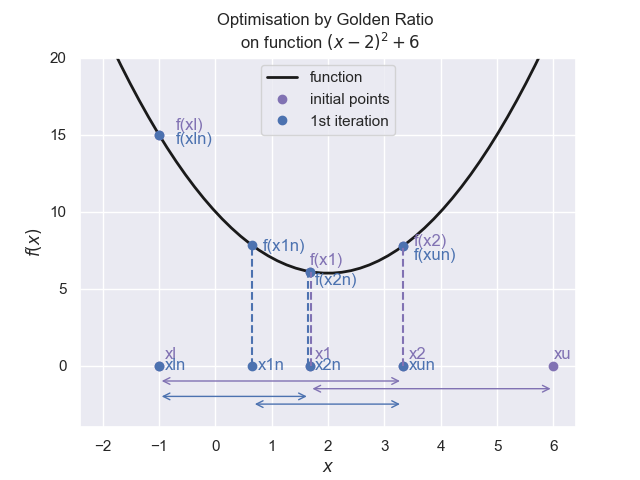

Welcome to Pesky Imps!
======================

.. topic:: Purpose

   The topics of interpolation, root finding, finding maxima and minima 
   (optimisation) are all closely related since many of the methods are 
   similar.

Interpolation
-------------

.. figure:: figures/lag_interp.png
    :width: 640
    :height: 512
    :align: center

Estimate values of data or function between known values.

.. toctree::
   :maxdepth: 2

   interp/interp_index

Extrapolation
-------------

Infer values of an unobserved interval, from values within an observed 
interval.

.. toctree::
   :maxdepth: 2

   extrap/index_extrap

Roots of an Equation
--------------------

.. figure:: figures/iqi_root.png 
    :width: 640
    :height: 480
    :align: center

Given some function, or data, find the location where :math:`f(x) = 0`.

.. toctree::
   :maxdepth: 2

   equation/index_equation

Optimisation
------------

Select the best value with regard to some criterion from the set of available
alternatives. It can be also thought of as finding the maximum or minimum of a
function.

.. toctree::
   :maxdepth: 2

   opt/index_opt

Authors
-------

.. toctree::
   :maxdepth: 2

   authors

General
-------

The **while loop**, **Pretty Table**

.. toctree::
   :maxdepth: 2

   /gen/general

   

Indices and tables
==================

* :ref:`genindex`
* :ref:`modindex`
* :ref:`search`
