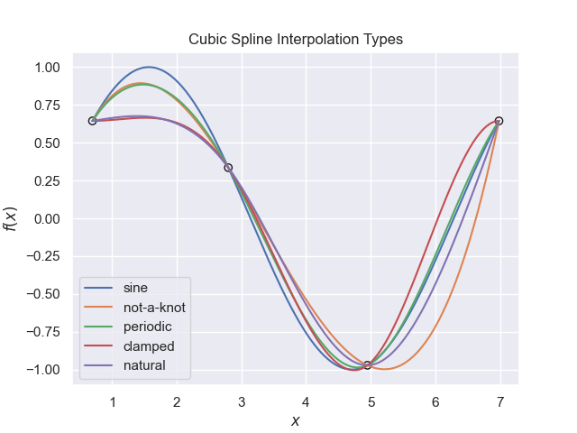
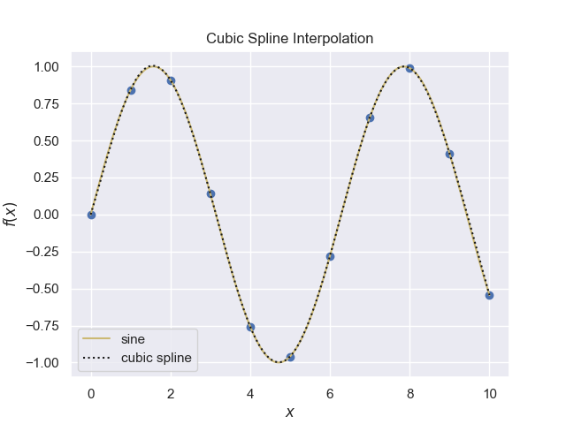
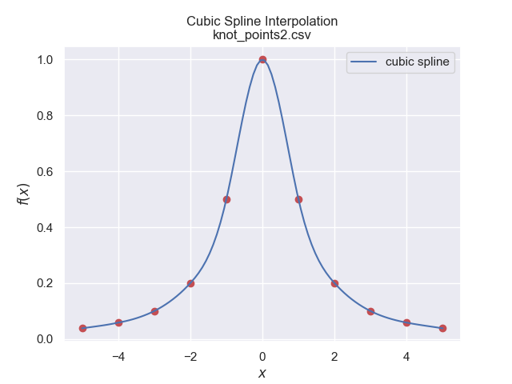

==========================
Cubic Spline Interpolation
==========================

Just like linear interpolation, cubic spline interpolation joins the data in 
a piecewise fashion, but requires four data points for each piecewise cubic
polynomial. For n points there are n-1 cubic functions, each requiring
their own set of 4 coefficients. 

.. math::
    S_i(x) = a_i \cdot x^3 + b_i \cdot x^2 + c_i \cdot x + d_i

Say we have 3 data points, this will require two piecewise (cubic spline)
functions. Each pair of data points has their own function with four unknown
coefficients, so we require 8 equations, (the middle point is used for
both functions). So far the points only supply two equations for each 
function, giving 4 equations. The first and second derivative is the same
for both functions, which gives two more equations. The last two equations
are supplied by adding **type**. As more datapoints and their 
functions are added so the same argument shows that there is sufficient
information to solve the equations.

.. note:: The cubic spline types are somewhat arbitrary and the selection
    is a value judgement based on appearance and data type

* `not-a-knot`
    The first and second curve segments are the same polynomial - scipy default

* `periodic`
    First and last y values are identical, f´(x0) = f´(xn); f´´(x0) = f´´(xn),
    with the first and second derivatives being equal at the first and last
    point.

* `clamped`
    First derivative at curve ends is zero, f´(x0) = f´(xn) = 0

* `natural`
    Second derivative at curve ends is zero, f´´(x0) = f´´(xn) = 0, this gives a straight line at both ends.

Each type affects the shape of the splines.

    
    Cubic spline interpolation of 3 data points on a sine curve.
    
    All four types pass through all three data points but their paths differ 
    slightly, knowledge of how the data is generated helps in finding the 
    best fit.

The simplest way to implement is to use the scipy module Interpolate and 
import cubic_interpolate.

.. note:: Periodic Type

    Setting this up may be a bit tricky if the original function is unknown.
    The first and second derivatives need to be equal, so probably best to 
    use another type if unsure.

    
    Using the cubic spline interpolation on a sine wave.

.. container:: toggle

    .. container:: header

        *Show/Hide Code* cub_spline_interp.py

    .. literalinclude:: ../examples/interp/cub_spline_interp.py

The cubic spline takes in its stride the data points that caused trouble
with the Lagrange and Newton polynomials.

    
    Using the cubic spline interpolation on a the data set knot_points2.

The result should be compared with the :ref:`Lagrange<knot-points>` polynomial.