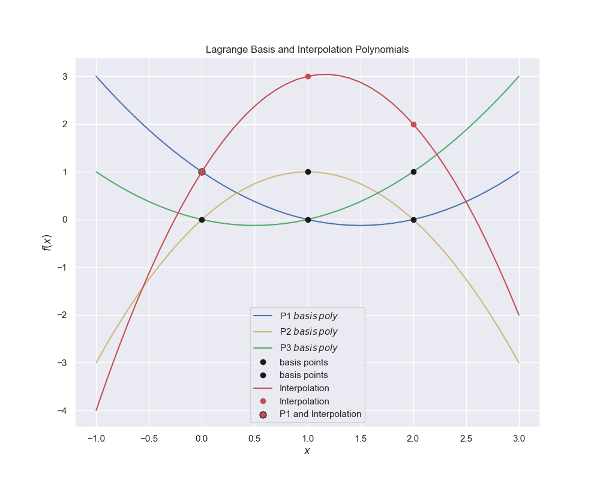
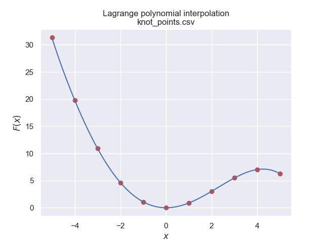

=================================
Lagrange Polynomial Interpolation
=================================

    
    Creating interpolation polynomial from basis polynomials.
    
    Only at their own points are the basis polynomials equal to 1, at the other 
    points they are zero. The final Lagrange polynomial interpolates through 
    all the data points. Point (0, 1) lies on the P1 lagrange polynomial and
    the interpolation polynomial.

With the interpolation seen so far the common theme is that the function
used in each method requires one more reference point than the degree of
polynomial. This can be generalised for the higher degree polynomials. One 
curve is fitted through all the reference points.

The final polynomial can be built from so called Lagrange basis polynomials
that have the property of having a value of 1 at its own data point and 0 
at the other points. 

.. math::

    P_i(x) = \prod_{j=1,j\neq i}^n \frac {x - x_j}{x_i - x_j}
    L(x) = \sum_{i=1}^n y_i P_i(x) \cdot

So for 3 points the polynomials are:-

.. math::

    P_1(x) &= \frac {(x - x_2) \cdot (x - x_3)}{(x_1 - x_3) \cdot (x_1 - x_3)} \\
    P_2(x) &= \frac {(x - x_1) \cdot (x - x_3)}{(x_2 - x_1) \cdot (x_2 - x_3)} \\
    P_1(x) &= \frac {(x - x_1) \cdot (x - x_2)}{(x_3 - x_1) \cdot (x_3 - x_2)}

.. math::

    L = x_1 \cdot P_1 + x_2 \cdot P_2 + x_3 \cdot P_3

|

.. container:: toggle

    .. container:: header

        *Show/Hide Code* lagrange_poly0.py

    .. literalinclude:: ../examples/interp/lagrange_poly0.py

One could just as easily multiply the basis polynomials before they are summed
to make the interpolation polynomial. When interpolating over more than three
reference points the Lagrange basis polynomial has to be enlarged, rather 
than expand the quadratic polynomial by hand use a script that manages the
process automatically. 

.. _lag-interp:

    
    Lagrange basis and interpolation polynomials for 4 points
    
    The basis polynomials go through its own point, at the other points they 
    have a value of zero. The interpolation polynomial goes through all the
    data points.

|

.. container:: toggle

    .. container:: header

        *Show/Hide Code* lagrange_plot_multi.py

    .. literalinclude:: ../examples/interp/lagrange_plot_multi.py

This method works best with only a few data points, otherwise the polynomial 
can fluctuate widely at the end points. 

    
    Lagrange interpolation polynomial for 11 points
    
    The polynomial is well behaved because of the large data spread

|

.. _knot-points:

    
    Lagrange interpolation polynomial for 11 points
    
    The polynomial is ill behaved but still passes through all the data points