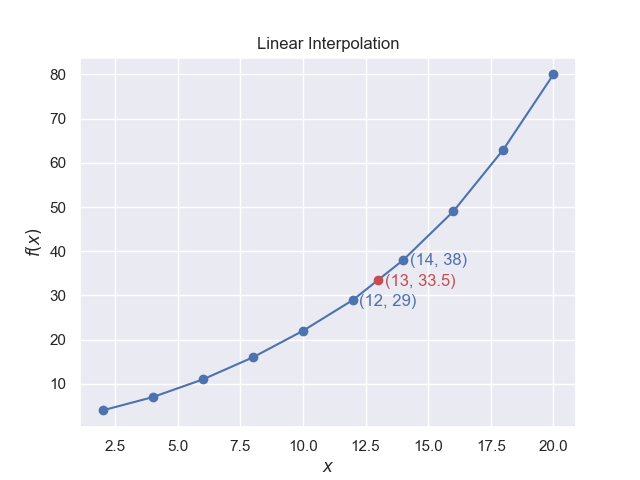

====================
Linear Interpolation
====================

    
    A plot of two lists of points, with an intermediate point being
    interpolated between two reference points

Linear interpolation relies on knowing the values of two points, then a
straight line equation can be drawn between them and the intermediate value
estimated. The form of the underlying equation creating those points remains 
unknown.

.. math::
    y = a \cdot x + b

This is the same as the form showing the slope (gradient) and intercept of
the line with the x-axis.

.. math::
    y = m \cdot x + c

Substituting for the two points :math:`(x_0,y_0)` and :math:`(x_1,y_1)`

.. math::
    y_0 &= a \cdot x_0 + b\\
    y_1 &= a \cdot x_1 + b\\
    a &= \frac {y_1 - y_0}{x_1 - x_0}\\
    b &= y_0 - x_0 \cdot \frac {y_0 - x_0}{x_1 - x_0}\\
    y &= \frac {y_1 - y_0}{x_1 - x_0} \cdot x + y_0 - x_0 \cdot \frac {y_0 - x_0}{x_1 - x_0}

.. _lin-interp:

.. math::
    y = y_0 + \frac {(x - x_0)(y_1 - y_0)}{(x_1 - x_0)}     \tag{1.1}

This equation is similar to the 
`Lerp <https://frothy-brew.readthedocs.io/en/latest/colour_picker/using_tkinter_widgets.html>`_ 
function used to calculate colours 
between two known colours. Look carefully at equation (1.1) and note how the 
variables are arranged, a similar arrangement will be shown in the Lagrange
interpolation. When plotting, no
additional computation is made explicitly, a command is given to the program
to join from point to point by lines. To render the lines intermediate points
must be drawn and linear interpolation is used to calculate where these lie.

Our example shows an intermediate point being calculated.

.. container:: toggle

    .. container:: header

        *Show/Hide Code* linear_interp.py

    .. literalinclude:: ../examples/interp/linear_interp.py

If the plot rapidly changes its slope linear interpolation is best replaced
by one of the methods following.