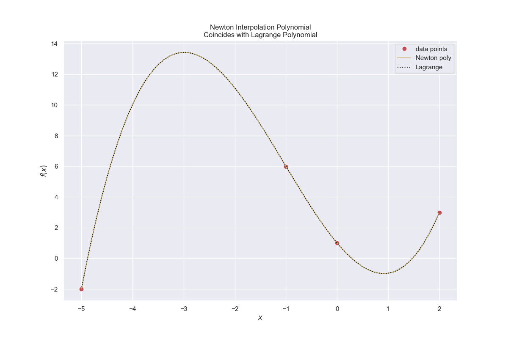

===============================
Newton Polynomial Interpolation
===============================

The method is similar to the Lagrange polynomial interpolation, just that 
the polynomial is computed differently. The end polynomial is similar, so
it should give the same plot as the Lagrange polynomial. 

.. math::
    
    f(x) = \sum _{i=0}^n a_i \, n_i (x)

where

.. math::

    n_i(x) = \prod _{j=0}^{i-1}(x - x_j)

The special feature of this polynomial is that the coefficents :math:`a_i`
can be easily determined.

.. math::

    f(x_0) = a_0 = y_0
    f(x_1) = a_0 + a_1(x_1 - x_0) = y_1

which becomes

.. math::

    a_1 = \frac{y_1 - y_0}{x_1 - x_0}

now insert the point :math:`(x_2,y_2)` to find :math:`a_2`

.. math::

    a_2 = \cfrac {\cfrac {y_2 - y_1}{x_2 - x_1} - \cfrac {y_1 - y_0}{x_1 - x_0}}{x_2 - x_0}

insert the point :math:`(x_3,y_3)` to find :math:`a_3`, produces another equation
of divided differences.

.. math::

    f[x_1,x_0] &= \frac {y_1 - y_0}{x_1 - x_0} \\
    f[x_2,x_1,x_0] &= \cfrac {\cfrac {y_2 - y_1}{x_2 - x_1} - \cfrac {y_1 - y_0}{x_1 - x_0}}{x_2 - x_0} \\
     &= \frac {f[x_2,x_1] - f[x_1,x_0]}{x_2 - x_0}

this produces the following iteration method

.. math::

    f[x_k,x_{k-1},...,x_1,x_0] = \frac {f[x_k,x_{k-1},...,x_2,x_1] - f[x_{k-1},x_{k-2},...,x_1,x_0]}{x_k - x_0}

produces the following divided difference coefficients in matrix form

.. math::

    \begin{array}{lcccc}
    &y_0 \; &f[x_1,x_0] \; &f[x_2,x_1,x_0] \; &f[x_3,x_2,x_1,x_0] \; &f[x_4,x_3,x_2,x_1,x_0] \\
    &y_1 \; &f[x_2,x_1] \; &f[x_3,x_2,x_1] \; &f[x_4,x_3,x_2,x_1] \;  &0\\
    &y_2 \; &f[x_3,x_2] \; &f[x_4,x_3,x_2] \;  &0 \; &0\\
    &y_3 \; &f[x_4,x_3] \; &0  \; &0  \; &0\\
    &y_4  \; &0 \; &0  \; &0  \; &0
    \end{array} 

The first row gives all the polynomial coefficients :math:`a_0,a_1,a_2,a_3`

    
    Newton interpolation through 4 points
    
    The Newton and Lagrange interpolation are compared

.. container:: toggle

    .. container:: header

        *Show/Hide Code* newton_divided_difference2.py

    .. literalinclude:: ../examples/interp/newton_divided_difference2.py

As stated before both methods produce the same results. If we were to test
it on more data points it could oscillate wildly at the ends (just like the
lagrange polynomial), therefore the 
cubic spline method is shown next, which overcomes this problem.
