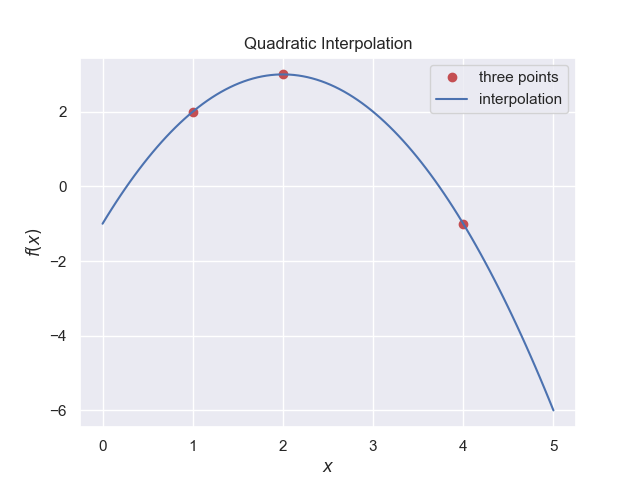

=======================
Quadratic Interpolation
=======================

    
    A plot of a quadratic curve interpolated between three reference points

Whereas the linear method uses two points, a quadratic uses three points 
and can be written as:-

.. math::

    y = a\cdot x^2 + b\cdot x + c

for each of the three points :math:`(x_0,y_0), (x_1,y_1), (x_2,y_2)` this
becomes:-

.. math::

    y_0 &= f(x_0) = a\cdot x_0^2 + b\cdot x_0 + c\\
    y_1 &= f(x_1) = a\cdot x_1^2 + b\cdot x_1 + c\\
    y_2 &= f(x_2) = a\cdot x_2^2 + b\cdot x_2 + c

when solved:-

.. math::

    y = y_0 \frac{(x - x_1)(x - x_2)}{(x0 - x_1)(x0 - x_2)} + y_1 \frac{(x - x_0)(x - x_2)}{(x1 - x_0)(x1 - x_2)}
    + y_2 \frac{(x - x_0)(x - x_1)}{(x2 - x_0)(x2 - x_1)}

The three points must not be colinear but need not be equidistant. If the 
middle point's y-value is either larger than or smaller than both the outer
points' y-values then it will generate a vertical parabola. A horizontal
parabola will be made if the mid point x-value is larger than both the outer
points' x-values. 

Check how the equation has progressed from the :ref:`linear<lin-interp>` equation.

In the example a quadratic is fitted through three points, which is then 
plotted.

.. container:: toggle

    .. container:: header

        *Show/Hide Code* quad_interp.py

    .. literalinclude:: ../examples/interp/quad_interp.py