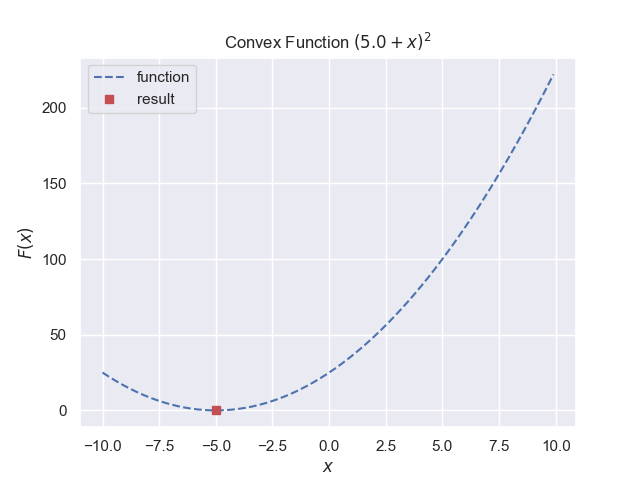
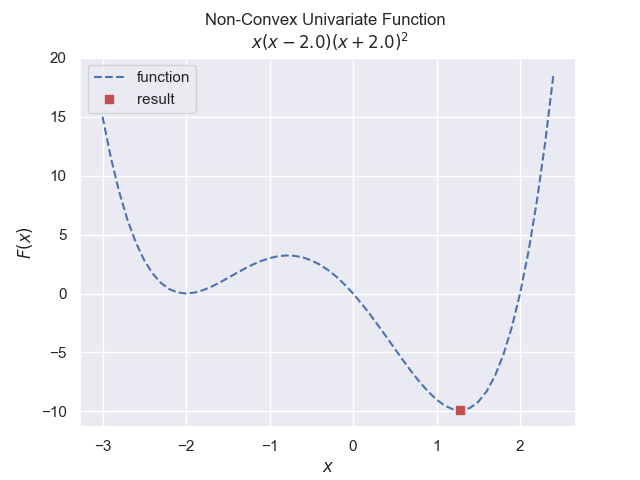
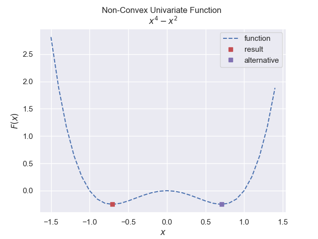

More Complex Functions
======================

If our function does not have a single maximum/minimum it makes the search
more difficult, and is probably more true to life than our simple functions
so far. This is when it is necessary to use the assistance of scipy.

Start with a simple minimum :math:`(5.0 + x)^2` use a bit of overkill with
the brent method.

    
    Convex function, has a minimum
    
    The result is the red point

The result of **minimize_scalar** can show whether the outcome was successful 
or not **success**, the evaluation **fun** at the output **x**, in a total
number of evaluations **nfev** in the number of iterations **nit**.

A graph is plotted which shows the minimum.

.. container:: toggle

    .. container:: header

        *Show/Hide Code* convex_function.py

    .. literalinclude:: ../examples/opt/convex_function.py

Multi-Extrema
-------------

The next example has a local and a global minimum, separated by a local 
maximum. Using the brent method in scipy as before the script found the 
global minimum using no additional conditions, even though no limits were 
set.

    
    Non-Convex univariate function, has more than one extrema
    
    The result is the red point

.. container:: toggle

    .. container:: header

        *Show/Hide Code* brent_non_convex.py

    .. literalinclude:: ../examples/opt/brent_non_convex.py

    
    Non-Convex univariate with equal extrema
    
    The results are the red and magenta points

In the special case where both minima are equal the optimize function may
require help::

    .......
    def objective(x):
        return x ** 4 - x ** 2
    ......
    result = minimize_scalar(objective, method='brent')
    ....

returns x: 0.707107, changing the minimize_scalar call to::

    result = minimize_scalar(objective, method='brent', bracket(-1,0))

does not change the result, so choose the different method **'bounded'**::

    result = minimize_scalar(objective, method='bounded', bounds=(-1,0))

which requires **bounds** rather than **bracket**. This returns x: -0.707107.

.. container:: toggle

    .. container:: header

        *Show/Hide Code* non_convex_univariate_equal.py

    .. literalinclude:: ../examples/opt/non_convex_univariate_equal.py

Scipy optimize is a far ranging library that is best read to ascertain its
`scope <https://docs.scipy.org/doc/scipy/tutorial/optimize.html>`_ . As seen
scipy can be also used for root finding, but the methods used would not have
been explained so easily.
