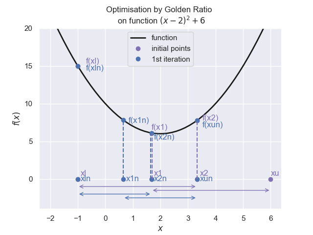

Golden Rule
===========

For simple situations a straightforward approach may be all that
is required. Using different ratios we may be able to improve on the interval
halving method. The golden ratio creates a very robust 
search method. This ratio can be thought as dividing a line into unequal
parts such that the ratio of the whole
to the larger part is the same as the ratio of the larger to the smaller
part.

The golden search method reduces the interval by first finding out in which
section contains a minimum / maximum.

.. math::

    \frac {a + b}{a} = \frac a b = \phi

This ratio translates into

.. math::

    \frac {\sqrt 5 +1}{2} = \phi

To use this rule first bracket the point of interest (maximum/minimum), by
points along the x-axis at **a** and **b** such that a < b, then
create two intermediate points (x1, x2) such that 

.. math::

    x1 &= a + d \\
    x2 &= b -d \\
    d &= \phi \cdot (b - a)

Initialise by bracketing the point of interest, insert two intermediate 
positions x1, x2

    | 1. Evaluate the function at the two intermediate points f(x1), f(x2)
    | 1.1. If f(x1) is less than f(x2) then x1 is closer to the minimum than x2. 
    | 1.2. The upper limit is discarded, which is beyond x2 (in this case b).
    | 1.3. The lower limit a, x1, x2 become the new a, x2, b and a new x1 is calculated, x2 is the old x1.
    | 2. else
    | 2.1. The lower limit is discarded
    | 2.2. x1, x2, b become the new a, x1, and b, a new x2 is calculated
    | 2.3. Test whether the absolute difference between the new upper and lower values reach the required limit or not. 

.. hint:: When searching for a maximum the same algorithm is used, only
    when comparing values f(x1) is more than f(x2) then x1 is closer to
    the maximum than x2

Apart from initialisation, when 2 additional points and their evaluations are 
required, iteration only requires one new point position and its evaluation. 
Three positions and their evaluation are re-used in the new iteration.

    Finding the mminimum, initialisation in magenta, first iteration in blue
    
    A plot with the initial limits and intermediate points divided according 
    to the golden ratio

After the lower and upper limits are chosen
the first two calculated points(x1 and x2) are evaluated. Since f(x1) is 
less than f(x2), the magenta dashed lines, at the first iteration x2 becomes
the new upper limit xun, the old lower limit xl becomes the new lower limit
xln, the old point x1 became x2n and x1n has to be recalculated. At the next
iteration as f(x2n) is less than f(x1n), the blue dashed lines, the lower 
limit will be discarded and a new x2 will have to be calculated.

Look carefully at the two sets of arrows, each set of two outer arrows are 
equal in length, the middle overlap being about a third of either the other
two arrows.

In the example below a minimum is being found, more evaluations than strictly
necessary are being made in order to show the progress of the script. 

.. container:: toggle

    .. container:: header

        *Show/Hide Code* gr_cyl.py

    .. literalinclude:: ../examples/opt/gr_cyl.py

This produced::

    +------+---------+---------+---------+---------+-----------+----------+-----------+-----------+---------+
    | step |    a    |    x1   |    x2   |    b    |    f(a)   |  f(x1)   |   f(x2)   |    f(b)   |   emax  |
    +------+---------+---------+---------+---------+-----------+----------+-----------+-----------+---------+
    |  0   |    1    | 2.52786 | 3.47214 |    5    | 106.28319 | 79.70925 | 104.54909 | 177.07963 |    4    |
    |  1   |    1    | 1.94427 | 2.52786 | 3.47214 | 106.28319 | 75.18479 |  79.70925 | 104.54909 | 2.47214 |
    |  2   |    1    | 1.58359 | 1.94427 | 2.52786 | 106.28319 | 78.90432 |  75.18479 |  79.70925 | 1.52786 |
    |  3   | 1.58359 | 1.94427 | 2.16718 | 2.52786 |  78.90432 | 75.18479 |  75.65298 |  79.70925 | 0.94427 |
    |  4   | 1.58359 |  1.8065 | 1.94427 | 2.16718 |  78.90432 | 75.86044 |  75.18479 |  75.65298 | 0.58359 |
    |  5   |  1.8065 | 1.94427 | 2.02942 | 2.16718 |  75.86044 | 75.18479 |  75.15274 |  75.65298 | 0.36068 |
    |  6   | 1.94427 | 2.02942 | 2.08204 | 2.16718 |  75.18479 | 75.15274 |  75.26674 |  75.65298 | 0.22291 |
    |  7   | 1.94427 | 1.99689 | 2.02942 | 2.08204 |  75.18479 | 75.13251 |  75.15274 |  75.26674 | 0.13777 |
    |  8   | 1.94427 | 1.97679 | 1.99689 | 2.02942 |  75.18479 | 75.13985 |  75.13251 |  75.15274 | 0.08514 |
    |  9   | 1.97679 | 1.99689 | 2.00932 | 2.02942 |  75.13985 | 75.13251 |  75.1356  |  75.15274 | 0.05262 |
    |  10  | 1.97679 | 1.98922 | 1.99689 | 2.00932 |  75.13985 | 75.1335  |  75.13251 |  75.1356  | 0.03252 |
    |  11  | 1.98922 | 1.99689 | 2.00164 | 2.00932 |  75.1335  | 75.13251 |  75.13301 |  75.1356  |  0.0201 |
    |  12  | 1.98922 | 1.99396 | 1.99689 | 2.00164 |  75.1335  | 75.13263 |  75.13251 |  75.13301 | 0.01242 |
    |  13  | 1.99396 | 1.99689 | 1.99871 | 2.00164 |  75.13263 | 75.13251 |  75.1326  |  75.13301 | 0.00768 |
    +------+---------+---------+---------+---------+-----------+----------+-----------+-----------+---------+
    Minimum found : at 1.9968944 value 75.1325103 in 13 steps

It was comparable with the interval halving.

This example is then revised to become recursive.

.. container:: toggle

    .. container:: header

        *Show/Hide Code* gss_recusive_rev1.py

    .. literalinclude:: ../examples/opt/gss_recusive_rev1.py
