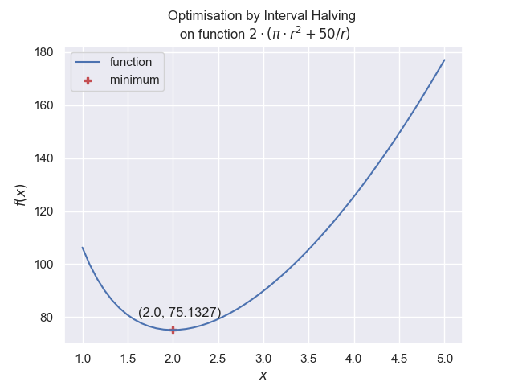


Halving the Interval
====================

    
    Minimum found in slow but steady method

Just as with root finding we can apply interval halving to find extrema.
Within the method the testing is changed, since the evaluated function seeks
to find values of the same sign (positive for minima and negative for 
maxima when the function is above the x-axis). In general solutions in 
the first quadrant, where x and y are positive, is of more interest than in 
the other quadrants. 

The main difference between this and root finder is at the conditional 
statement::

    # root finding
    if Fa*F1 < 0:
        b = x1
        Fb = F1
    else:
        a = x1
        Fa = F1

    # minimum finding
    if Fa < Fb:
        b = x1
        Fb = F1
    else:
        a = x1
        Fa = F1

The result of finding the minimum is as follows::

    +------+-----+-----------+-----------+-------------+-------------+------------+-----------+
    | step |  a  |     b     |     x1    |     f(a)    |     f(b)    |   f(x1)    |   emax   |
    +------+-----+-----------+-----------+-------------+-------------+------------+-----------+
    |  0   |  1  |     5     |    3.0    | 106.2831853 | 177.0796327 | 89.8820011 |    2.0    |
    |  1   |  1  |    3.0    |    2.0    | 106.2831853 |  89.8820011 | 75.1327412 |    1.0    |
    |  2   | 2.0 |    3.0    |    2.5    |  75.1327412 |  89.8820011 | 79.2699082 |    0.5    |
    |  3   | 2.0 |    2.5    |    2.25   |  75.1327412 |  79.2699082 | 76.2530701 |    0.25   |
    |  4   | 2.0 |    2.25   |   2.125   |  75.1327412 |  76.2530701 | 75.4313322 |   0.125   |
    |  5   | 2.0 |   2.125   |   2.0625  |  75.1327412 |  75.4313322 | 75.2129297 |   0.0625  |
    |  6   | 2.0 |   2.0625  |  2.03125  |  75.1327412 |  75.2129297 | 75.1550445 |  0.03125  |
    |  7   | 2.0 |  2.03125  |  2.015625 |  75.1327412 |  75.1550445 | 75.1393774 |  0.015625 |
    |  8   | 2.0 |  2.015625 | 2.0078125 |  75.1327412 |  75.1393774 | 75.1349217 | 0.0078125 |
    |  9   | 2.0 | 2.0078125 | 2.0039062 |  75.1327412 |  75.1349217 | 75.133546  | 0.0039062 |
    |  10  | 2.0 | 2.0039062 | 2.0019531 |  75.1327412 |  75.133546  | 75.1330721 | 0.0019531 |
    |  11  | 2.0 | 2.0019531 | 2.0009766 |  75.1327412 |  75.1330721 | 75.1328888 | 0.0009766 |
    |  12  | 2.0 | 2.0009766 | 2.0004883 |  75.1327412 |  75.1328888 | 75.1328105 | 0.0004883 |
    |  13  | 2.0 | 2.0004883 | 2.0002441 |  75.1327412 |  75.1328105 | 75.1327748 | 0.0002441 |
    |  14  | 2.0 | 2.0002441 | 2.0001221 |  75.1327412 |  75.1327748 | 75.1327577 | 0.0001221 |
    |  15  | 2.0 | 2.0001221 |  2.000061 |  75.1327412 |  75.1327577 | 75.1327494 |  6.1e-05  |
    +------+-----+-----------+-----------+-------------+-------------+------------+-----------+
    Minimum found : at 2.0000305 value 75.1327494 in 15 steps

The root was found in 15 iterations, but it did not change the lower limit
for most of the computation.

.. container:: toggle

    .. container:: header

        *Show/Hide Code* my_half.py

    .. literalinclude:: ../examples/opt/my_half.py

In the next script an extra level of testing is used to avoid the computations
sticking on a limit::

    +------+-----------+-----------+-----------+------------+-----------+
    | step |     a     |     x2    |     b     |   f(x2)    |    tol    |
    +------+-----------+-----------+-----------+------------+-----------+
    |  0   |     1     |    3.0    |     5     | 89.8820011 |    2.0    |
    |  1   |     1     |    2.0    |    3.0    | 75.1327412 |    1.0    |
    |  2   |    1.5    |    2.0    |    2.5    | 75.1327412 |    0.5    |
    |  3   |    1.75   |    2.0    |    2.25   | 75.1327412 |    0.25   |
    |  4   |   1.875   |    2.0    |   2.125   | 75.1327412 |   0.125   |
    |  5   |   1.9375  |    2.0    |   2.0625  | 75.1327412 |   0.0625  |
    |  6   |  1.96875  |    2.0    |  2.03125  | 75.1327412 |  0.03125  |
    |  7   |  1.984375 |    2.0    |  2.015625 | 75.1327412 |  0.015625 |
    |  8   | 1.9921875 |    2.0    | 2.0078125 | 75.1327412 | 0.0078125 |
    |  9   | 1.9921875 | 1.9960938 |    2.0    | 75.1325097 | 0.0039062 |
    |  10  | 1.9941406 | 1.9960938 | 1.9980469 | 75.1325097 | 0.0019531 |
    |  11  | 1.9951172 | 1.9960938 | 1.9970703 | 75.1325097 | 0.0009766 |
    |  12  | 1.9960938 |  1.996582 | 1.9970703 | 75.1325072 | 0.0004883 |
    |  13  | 1.9963379 |  1.996582 | 1.9968262 | 75.1325072 | 0.0002441 |
    |  14  | 1.9963379 |  1.99646  |  1.996582 | 75.132507  | 0.0001221 |
    |  15  | 1.9963989 |  1.99646  |  1.996521 | 75.132507  |  6.1e-05  |
    |  16  | 1.9964294 |  1.99646  | 1.9964905 | 75.132507  |  3.05e-05 |
    +------+-----------+-----------+-----------+------------+-----------+
    Minimum found : at 1.9964600 value 75.1325070 in 16 steps

There was no discernable improvement, but the computations were not stuck on 
a single limit and should be better for other functions.

.. container:: toggle

    .. container:: header

        *Show/Hide Code* half_cylinder_rev.py

    .. literalinclude:: ../examples/opt/half_cylinder_rev.py

