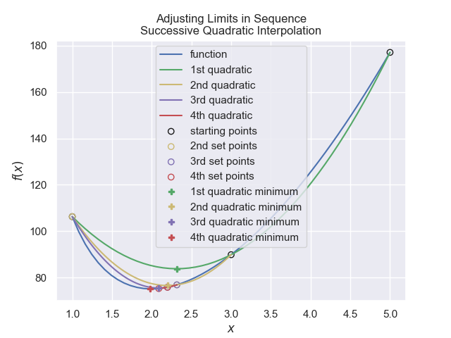
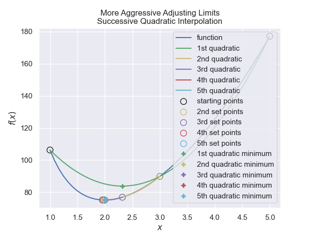

==================================
Optimise with Quadratic Polynomial
==================================

If one can approximately find a minimum then using a quadratic polynomial
interpolate through three starting points. 

The quadratic polynomial has a minimum when its first derivative is zero.

.. math::
    y &= f(x) = a\cdot x^2 + b\cdot x + c \\
    \frac {dy}{dx} &= 2\cdot a\cdot x + b = 0 \\
    b &= - 2\cdot a

The Newton Raphson interpolating polyomial passing through three points
(a,f(a), b,f(b), c,f(c)) can be expressed as

.. math::
    g(x) &= f(a) + \alpha\cdot(x - a) + \beta \cdot(x - a)(x - b) \\
    \frac {dg}{dx} &= \alpha + \beta\cdot(2x - a - b) = 0 \\
    x &= \frac{a + b}{2} - \frac{\alpha}{\beta}

where the coefficients :math:`\alpha ,\beta` are determined from g(a) = f(a),
g(b) = f(b), g(c) = f(c)

.. math::
    \alpha &= \frac {f(b) - f(a)}{b - a} \\
    \beta &= \frac {f(c) - f(a) - \alpha(c -a)}{(c - a)(c - b)}

    
    Overview of successive quadratic interpolation
    
    For the sake of simplicity some speed has been sacrificed

The method is not guaranteed to converge, and works best when the limits 
bracket the point of interest. The following script changes the inputs in 
rotation without any additional conditions.

.. container:: toggle

    .. container:: header

        *Show/Hide Code* successive_parabolic_interpolation.py

    .. literalinclude:: ../examples/opt/successive_parabolic_interpolation.py

gave the following result::

    +------+-----------+-----------+-----------+-----------+-------------+-------------+-------------+------------+-----------+
    | step |     a     |     b     |     c     |     x     |      fa     |      fb     |      fc     |     fx     |    emax   |
    +------+-----------+-----------+-----------+-----------+-------------+-------------+-------------+------------+-----------+
    |  0   |     5     |     3     |     1     |    None   | 177.0796327 |  89.8820011 | 106.2831853 |    None    |     4     |
    |  1   |     5     |     3     |     1     | 2.3166288 | 177.0796327 |  89.8820011 | 106.2831853 | 76.8865773 |     4     |
    |  2   |     3     |     1     | 2.3166288 | 2.1983511 |  89.8820011 | 106.2831853 |  76.8865773 | 75.8536877 |     2     |
    |  3   |     1     | 2.3166288 | 2.1983511 | 2.0890269 | 106.2831853 |  76.8865773 |  75.8536877 | 75.2892082 | 1.3166288 |
    |  4   | 2.3166288 | 2.1983511 | 2.0890269 | 1.9790689 |  76.8865773 |  75.8536877 |  75.2892082 | 75.1382498 | 0.2276019 |
    |  5   | 2.1983511 | 2.0890269 | 1.9790689 |  1.994337 |  75.8536877 |  75.2892082 |  75.1382498 | 75.132593  | 0.2192822 |
    |  6   | 2.0890269 | 1.9790689 |  1.994337 | 1.9967646 |  75.2892082 |  75.1382498 |  75.132593  | 75.1325086 |  0.109958 |
    |  7   | 1.9790689 |  1.994337 | 1.9967646 | 1.9964674 |  75.1382498 |  75.132593  |  75.1325086 | 75.132507  | 0.0176957 |
    |  8   |  1.994337 | 1.9967646 | 1.9964674 | 1.9964728 |  75.132593  |  75.1325086 |  75.132507  | 75.132507  | 0.0024276 |
    |  9   | 1.9967646 | 1.9964674 | 1.9964728 | 1.9964727 |  75.1325086 |  75.132507  |  75.132507  | 75.132507  | 0.0002972 |
    |  10  | 1.9964674 | 1.9964728 | 1.9964727 | 1.9964727 |  75.132507  |  75.132507  |  75.132507  | 75.132507  |  5.4e-06  |
    +------+-----------+-----------+-----------+-----------+-------------+-------------+-------------+------------+-----------+
    Found x = 1.996473 with f(x) = 75.13251 after 10 steps

The method of calculating the quadratic can be simplified but then one must 
ensure that the order of starting points is ascending in the x-axis. As a 
general factor the middle point must have a value below the values of the two
outer points, otherwise the quadratic does not become concave enough to form 
a minimum.

    
    A more aggressive limit changing with successive quadratic interpolation

Using a robust quadratic function with a more aggressive change to the limits,
also the middle point **b** is always updated by the calculated point **x**,
the outer limit with the largest value becomes the old middle point and as
a last change the other outer limit is reduced to a quarter of its old position
relative to the calculated point::

    +------+-----------+-----------+-----------+-----------+-------------+------------+-------------+------------+-----------+
    | step |     a     |     b     |     c     |     x     |      fa     |     fb     |      fc     |     fx     |    emax   |
    +------+-----------+-----------+-----------+-----------+-------------+------------+-------------+------------+-----------+
    |  0   |     1     |     3     |     5     | 2.3166288 | 106.2831853 | 89.8820011 | 177.0796327 | 76.8865773 |     4     |
    |  1   | 1.9874716 | 2.3166288 |     3     | 1.9551871 |  75.1340388 | 76.8865773 |  89.8820011 | 75.1650885 | 1.0125284 |
    |  2   | 1.9632582 | 1.9551871 | 2.3166288 | 2.0000493 |  75.1535364 | 75.1650885 |  76.8865773 | 75.1327478 | 0.3614417 |
    |  3   | 1.9908515 | 2.0000493 | 1.9551871 | 1.9964618 |  75.1331037 | 75.1327478 |  75.1650885 | 75.132507  | 0.0448623 |
    |  4   | 1.9950593 | 1.9964618 | 2.0000493 | 1.9964736 |  75.1325447 | 75.132507  |  75.1327478 | 75.132507  | 0.0049901 |
    |  5   |  1.99612  | 1.9964736 | 1.9964618 | 1.9964727 |  75.1325093 | 75.132507  |  75.132507  | 75.132507  | 0.0003536 |
    |  6   | 1.9964736 | 1.9964727 |  1.99647  | 1.9964727 |  75.132507  | 75.132507  |  75.132507  | 75.132507  |  3.6e-06  |
    +------+-----------+-----------+-----------+-----------+-------------+------------+-------------+------------+-----------+
    Found x = 1.996473 with f(x) = 75.13251 after 6 steps

.. container:: toggle

    .. container:: header

        *Show/Hide Code* successive_parabolic_interpolation1.py

    .. literalinclude:: ../examples/opt/successive_parabolic_interpolation1.py